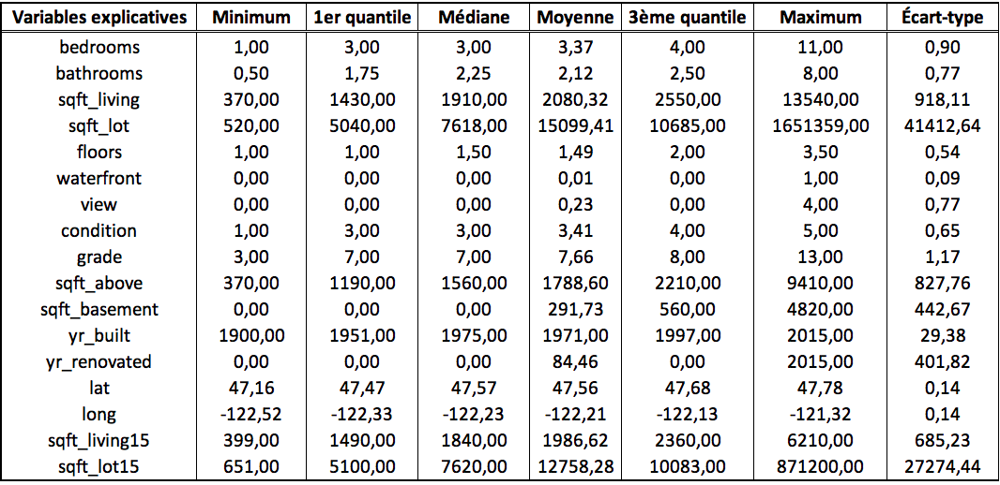

\begin{titlingpage}
  \rightline{Équipe 2}
  \centering
  \Large
  Travail fait par \\
  \vspace{1cm}
  \text{Matis Brassard-Verrier (111 182 740) }\\
  \text{Alyson Marquis (111 183 605)}\\
  \text{Alexis Picard (111 182 200)}\\
  \text{Samuel Provencher (111 181 794)}\\
  \vfill
  \Large
  Apprentissage statistique en actuariat \\
  \vspace{0.5cm}
  \text{ACT-3114}
  \vfill
  \Large
  Rapport 1\\
  \vfill
  \Large
  Présenté à\\
  \vspace{0.5cm}
  \text{Marie-Pier Côté}
  \vfill
  \Large
  École d'actuariat\\
  \text{Université Laval}\\
  \text{27 février 2020}
\end{titlingpage}

\pagenumbering{gobble}

\tableofcontents

\newpage
\pagenumbering{arabic}

```{r echo=FALSE, message=FALSE, warning=FALSE}
donnees <- read.csv("kc_house_data.csv")

donnees <- donnees[!donnees$bathrooms == 0,] #10 cas
donnees <- donnees[!donnees$bedrooms == 0,] #13 cas
#6 cas ont bedrooms = 0 et bathrooms = 0
#Si on considère que c'est des maisons/jumelé, on trouve ça peu logique de conserver les 6 cas sans chambres (s'il y avait appart, ça pourrait faire du sens)

#suppression 33 chambres
donnees <- donnees[!donnees$bedrooms == 33,]

#suppression sqft_living (redondance), id et zipcode
donnees <- donnees[,-c(which(colnames(donnees)=="sqft_living"), which(colnames(donnees)=="id"),
                       which(colnames(donnees)=="zipcode"))]

#separation champs de la date
donnees$date <- substr(donnees$date,1,8)
annee <- substr(donnees$date,1,nchar(donnees$date)-4)
mois <- substr(donnees$date,nchar(donnees$date)-3,nchar(donnees$date)-2)
jour <- substr(donnees$date, nchar(donnees$date)-1, nchar(donnees$date))

#changement format date
donnees$date <- as.POSIXct(paste(annee,mois,jour,sep="-"), format="%Y-%m-%d", tz="UTC")

# facteur 0-1 pour la reno
donnees$reno <- (donnees$yr_renovated==0)*1

#creation de la variable age
donnees$age <- ifelse(as.numeric(annee) - donnees$yr_built >= 0, as.numeric(annee) - donnees$yr_built, 0) #cap à 115

#lat et long, on prendra la heat map
library(ggmap)
register_google(key = "AIzaSyDR2ob6a6HSgsBhZkN -k0QNVeJT3uio4Wg") 

#map<-get_map(location = c(left = min(donnees$long), bottom = min(donnees$lat), right = max(donnees$long), top = max(donnees$lat)))

xmin <-  -122.4
xmax <-  -122
ymin <-  47.5
ymax <-  47.72

#Removed 2 rows containing missing values (geom_tile). ???

donnees$expensive_area <- sapply(1:nrow(donnees),
    function(i) as.numeric(donnees$lat[i] >= ymin & donnees$lat[i] <= ymax & donnees$long[i] >= xmin & donnees$long[i] <= xmax))
```
\section{Introduction}
Dans le cadre du travail, le prix de vente des maisons dans la région de Seattle (King County, USA) sera modélisé en utilisant de nombreuses caractéristiques ayant une incidence sur la valeur d'une maison. Le prix de vente d'une maison est une valeur positive évaluée en dollars américains. Cette valeur modélisée pourrait être utile pour différentes raisons. Comme la somme assurée d'une maison a un lien très fortement proportionnel à son prix de vente, une compagnie d'assurance pourrait être intéressée de modéliser le prix de vente de maisons dans des nouveaux développements immobiliers afin de tenter de prédire les futures soumissions d'assurance habitation et d'offrir des offres personnalisées aux acheteurs de ces nouvelles maisons. Dans un autre contexte, au niveau de la gestion des risques, certains assureurs ont un portefeuille de prêts hypothécaires ou utilisent des produits dérivés sur prêts hypothécaires pour se couvrir du risque (*hedging*). Ainsi, il pourrait être intéressant d'avoir une estimation des montants de prêts hypothécaires dans une région donnée en se basant sur le prix de vente des maisons afin de mieux gérer le risque de la compagnie. La pertinence de trouver cette variable qu'est le prix de vente des maisons devient alors fort intéressante. Le jeu de données utilisé sera le suivant : [kc_house_sales (House sales in King County, USA)](https://www.kaggle.com/harlfoxem/housesalesprediction). Il contient de nombreuses variables explicatives qui seront analysées dans la prochaine section. 

\newpage
\section{Analyse exploratoire des données}
Tout d'abord, afin de bien comprendre la base de données choisie, une analyse exploratoire des données est nécessaire. La présente section traite des erreurs décelées dans le jeu de données et fournit des informations pertinentes sur les variables exogènes ainsi que sur la variable réponse sous forme d'une analyse univariée et bivariée.

\subsection{Traitement des erreurs}
La visualisation des données à l'étude a permis de déceler quelques erreurs. Tout d'abord, $10$ observations avaient un nombre de salle de bain égal à $0$. Étant donné qu'il est impossible d'avoir une maison sans salle de bain et que ces observations représentent qu'un faible pourcentage du jeu de données, il a été convenu de supprimer ces $10$ observations. Après avoir enlevé ces $10$ observations, il a été remarqué que $6$ maisons comptaient $0$ chambre. En analysant de plus près ces cas, il a été possible de constater que toutes les autres colonnes étaient remplies, donc il ne s'agit pas de données manquantes. De plus, comme ces données contenaient toutes un terrain et qu'elles représentaient une faible proportion des données, il a été décidé de les enlever. En outre, une observation avait $33$ chambres. En se fiant à l'aire habitable de la maison ainsi qu'aux nombre de salles de bain de cette maison, il a été convenu que le nombre de chambres avait subi une erreur de frappe. Puisqu'il était impossible de déterminer avec certitude le véritable nombre de chambres de la maison, il a été décidé de simplement retirer cette observation du jeu du données. En effet, comme nous avons un nombre considérable d'entrées dans la base de données (plus de 21000), les conséquences d'enlever une seule entrée de donnée fautive sont minimes. Il a aussi été envisagé d'imputer stochastiquement la donnée manquante, mais il a été réalisé que les tests statistiques pour déterminer un patron de non-réponse ne sont pas concluants lorsqu'on a uniquement une observation manquante sur plus de 21000 observations.


\subsection{Analyse univariée}
\subsubsection{Variables explicatives}
La base de données initiales comptaient $20$ variables explicatives. Or, certaines de ces variables n'étaient pas pertinentes dans la modélisation du prix de vente des maisons. Ainsi, $2$ variables explicatives ont été retirées du jeu de données, soit le numéro d'identification de la vente (*ID*) et le code postal (*zipcode*). Le code postal a été retiré, car le jeu de données contient d'autres variables plus précises sur la localisation des différentes maisons. De plus, la variable *Date* a été mise sous le format suivant : année-jour-mois. Voici d'ailleurs un tableau qui présente les variables explicatives retenues ainsi qu'une brève description de celles-ci.

|   Variables explicatives |     Descriptions                                                    |      
| :----------------------: |:-------------------------------------------------------------------| 
|         Date             |  Date de la vente                                                   |     
|         Bedrooms         |  Nombres de chambres                                                |     
|         Bathrooms        |  Nombres de salles de bain ($0.5$ lorsqu'il n'y pas de douche)      |     
|         Sqft_living      |  Superficie habitable en pieds carrés                              | 
|         Sqft_lot         |  Superficie du terrain en pieds carrés                            | 
|         Floors           |  Nombre d'étages                                                    |  
|         Waterfront       |Indique si la maison a une vue sur l'eau ($1$ si oui, $0$ autrement) |     
|         View             |  Qualité de la vue extérieure allant de $0$ à $4$                   |     
|         Condition        | Condition de la maison allant de $1$ à $5$                          |     
|         Grade            |Qualité de la contrustion et de la conception allant de $1$ à $13$   | 
|         Sqft_above       |  Superficie habitable au-dessus du niveau du sol en pieds carrés    | 
|         Sqft_basement    |  Superficie habitable du sous-sol en pieds carrés                   |         
|         Yr_built         |  Année de construction                                              | 
|         Yr_renovated     |  Année de rénovation ($0$ si jamais rénovée)                        | 
|         Lat              |  Latitude                                                           | 
|         Long             |  Longitude                                                          | 
|         Sqft_living15    | Superficie habitable moyenne en pieds carrés des 15 plus proches voisins |   
|         Sqft_lot15       |  Superficie moyenne du terrain en pieds carrés des 15 plus proches voisins | 

Comme on peut le voir, cette base de données contient des variables assez intéressantes. En effet, elle est composée de variables numériques, temporelles ainsi que spaciales. Cela nous permettra de représenter les données à l'aide d'une carte de la région de Seattle.

```{r echo=FALSE, message=FALSE}
# library(knitr)
# library(kableExtra)
# 
# gr <- table(donnees$grade)
# co <- as.numeric(table(donnees$condition))
# vi <- as.numeric(table(donnees$view))
# wa <- as.numeric(table(donnees$waterfront))
#
# ll <- max(length(gr), length(co), length(vi), length(wa))

#gr <- c(gr, rep(0, ll-length(gr)))
# co <- c(co, rep(0, ll-length(co)))
# vi <- c(vi, rep(0, ll-length(vi)))
# wa <- c(wa, rep(0, ll-length(wa)))
# 
# dt <- data.frame(Valeurs = row.names((table(donnees$grade))), Grade = as.numeric(gr))
# 
# kable(dt)

```

Pour poursuivre, le tableau ci-dessous présente les caractéristiques sommatives des variables explicatives. 

{width="100%"}

Il est possible de faire ressortir quelques informations de ce tableau. Tout d'abord, la variable *grade* est une variable qui prend des valeurs entières de $1$ à $13$. Or, le minimun est de $3$. Aucun impact n'est envisagé quant à l'analyse de cette variable puisque les graphiques seront gradués de $3$ à $13$. De plus, quelques variables ont un très grand écart-type, soit *sqft_lot*, *sqft_lot15*, *sqft_above*, *sqft_basement*, *sqft_living15* et *sqft_living*. Ainsi, il faudra porter une attention particulière lors de la représentation graphique de ces variables. Une transformation quelconque, telle que la transformation logarithmique, pourrait être de mise. Il est également possible de constater que la proportion de maisons situées sur le bord d'un lac est de `r round(mean(donnees$waterfront),2)*100` %.

Maintenant, analysons de plus près certaines de ces variables.
\newline
\newline
**Date**
\newline
Le graphique suivant présente la densité de la variable *Date*.
```{r echo=FALSE, message=FALSE,fig.pos='H', fig.height=3, fig.width=4, fig.align="center"}
library(gridExtra)
library(ggplot2)

date <- ggplot(donnees, aes(x=date)) + geom_density() +
  ggtitle("Distribution des ventes de maisons dans l'année") +
  xlab("Date") + ylab("Densité") +
  theme_bw() + #asymétrie
  theme(plot.title = element_text(hjust = 0.5, size = 10), axis.title = element_text(size=8))
   

grid.arrange(date ,nrow = 1, ncol=1)

```
Il est possible de constater qu'il semble y avoir un effet de saisonnalité dans la vente de maisons. En effet, l'été semble être une période où il y a beaucoup de ventes de maisons tandis que l'hiver semble être une période où la vente de maisons est moins fréquente. C'est important d'être au fait de cette tendance dans le domaine immobillier.
\newline
\newline
**Yr_built**
\newline
Le graphique suivant illustre la distribution de l'année de construction.

```{r echo=FALSE, message=FALSE,fig.pos='H', fig.height=3, fig.width=4, fig.align="center"}

year <- ggplot(donnees, aes(x=yr_built)) + geom_density() +
  ggtitle("Distribution des années de construction") +
  xlab("Année de construction") + ylab("Densité") +
  theme_bw() + 
  theme(plot.title = element_text(hjust = 0.5, size = 10), axis.title = element_text(size=8))

          
grid.arrange(year ,nrow = 1, ncol=1)

```

Tout d'abord, il est possible de constater que la base de données contient plus de maisons récentes que de vieilles maisons. On semble remarquer $2$ augmentations majeures sur le graphique. En effet, il y a une hausse vers les années $1950$, puis une seconde vers le début des années $2000$. De plus, on constate une légère concentration de maisons construites en $1900$. Plus précisément, $87$ maisons ont été construites en $1900$. Or, le nombre de maisons construites en $1901$ et $1902$ est similaire à celui pour $1900$. Ainsi, nous avons pris l'hypothèse que les données ont été collectées sur des maisons construites à partir de $1900$.

\subsubsection{Variable réponse}
La variable réponse de notre jeu de données est la variable *price*. Elle représente le prix de vente des maisons dans la région de Seattle et est illustrée par les graphiques suivants.
```{r echo=FALSE, message=FALSE,fig.pos='H', fig.height=3, fig.width=6, fig.align="center"}
library(gridExtra)

#https://stackoverflow.com/questions/30026887/plot-title-at-bottom-of-plot-using-ggplot2 pour mettre en-dessous

pri <- ggplot(donnees, aes(x=price/1000000)) + geom_density() + ##Pour que le pas de graduation soit beau
  ggtitle("Distribution du prix de vente des maisons") +
  xlab("Prix de vente des maisons (M$)") + ylab("Densité") +
  theme_bw() + #asymétrie
  theme(plot.title = element_text(hjust = 0.5, size = 7), axis.title = element_text(size=6))

Lpri <- ggplot(donnees, aes(x=log(price))) + geom_density() + 
  ggtitle("Distribution du logarithme du prix de vente des maisons") +
  xlab("Logarithme du prix de vente des maisons") + ylab("Densité") +
  theme_bw() + #log pour variable réponse est mieux
  theme(plot.title = element_text(hjust = 0.5, size = 7), axis.title = element_text(size=6))

grid.arrange(pri, Lpri ,nrow = 1, ncol=2)

```
Lorsqu'on regarde le graphique de gauche, où aucune transformation logarithmique n'a été effectuée sur la variable du prix, il est possible de remarquer que la distribution a une forte asymétrie à droite. Cela a pour effet de décaler la distribution à gauche de la médiane et d'étaler la queue de la distribution vers la droite. Ainsi, dans cette représentation graphique, un grand nombre d'observations est regroupé dans des prix plus faibles.

Pour pallier cette asymétrie, la transformation logarithmique a été effectuée sur la variable réponse. Le résultat est présenté sur le graphique de droite. Il est possible de constater que la distribution dans ce graphique est symétrique et qu'elle s'approche de la forme d'une loi normale. Ainsi, il sera plus facile de modéliser le logarithme et d'analyser les résultats.


\subsection{Analyse bivariée}
\newpage
\subsubsection{Heatmap}
```{r echo=FALSE, message=FALSE,warning=FALSE,fig.pos='H', fig.height=3, fig.width=9, fig.align="center"}

library(ggmap)
register_google(key = "AIzaSyDR2ob6a6HSgsBhZkN -k0QNVeJT3uio4Wg") 

map<-get_map(location = c(left = min(donnees$long), bottom = min(donnees$lat), right = max(donnees$long), top = max(donnees$lat)))

ggmap(map, extent = "device") + stat_summary_2d(data = donnees ,
                                                aes(x = long, y = lat, z = log(price)),
                                                fun = mean, alpha = 0.6, bins = 100) + 
    scale_fill_gradient(name = "Log(Price)", low = "green", high = "red") +
    annotate("rect", xmin = xmin, xmax = xmax, ymin = ymin, ymax = ymax, colour="black", lty = 1, lwd = 1.3, alpha = 0) +
    annotate("text", x= -122.2, y = 47.6, label = "Zone urbaine") +
  ggtitle("King County, USA") +
  theme(plot.title = element_text(hjust = 0.5))


```

**Date en fonction du logarithme du prix**
\newline
```{r echo=FALSE, message=FALSE,fig.pos='H', fig.height=3, fig.width=6, fig.align="center"}
library(gridExtra)

Lpri <- ggplot(donnees, aes(x=date, y=log(price))) + geom_point(alpha=0.1) + 
  ggtitle("Logarithme du prix de vente des maisons selon le moment de l'année") +
  xlab("Moment de l'année") + ylab("Logarithme du prix de vente") +
  theme_bw() +
  theme(plot.title = element_text(hjust = 0.5, size = 10), axis.title = element_text(size=8,))

grid.arrange(Lpri,nrow = 1, ncol=1)

```
Le graphique ci-dessus montre qu'il n'y a pas de relation linéaire entre le moment de la vente de la maison et le logarithme du prix obtenu. En effet, peu importe la date, le logarithme du prix semble distribué normalement et la variance des obseravations est constante dans le temps. Il est intéressant de remarquer que les transactions sont fort probablement regroupées par semaine (lundi au vendredi) dû à l'horaire des bureaux de notaires, ce qui veut dire qu'aucune ou peu de transactions sont conclues la fin de semaine.
\newline
\newline
**Variables *bedrooms*, *bathrooms* et *floors***
\newline
```{r echo=FALSE, message=FALSE,fig.pos='H', fig.height=6, fig.width=6, fig.align="center"}
library(gridExtra)

bed <- ggplot(donnees, aes(x=factor(bedrooms), y=log(price))) + geom_boxplot() + 
  ggtitle("Effet du nombre de chambres sur le prix de vente d'une maison") +
  xlab("Nombre de chambres") + ylab("Logarithme du prix de vente") +
  theme_bw() +
  theme(plot.title = element_text(hjust = 0.5, size = 6), axis.title = element_text(size=6))

bath <- ggplot(donnees, aes(x=factor(round(bathrooms)), y=log(price))) + geom_boxplot() + #Floor ou round ici
  ggtitle("Effet du nombre de salles de bain sur le prix de vente d'une maison") +
  xlab("Nombre de salles de bain") + ylab("Logarithme du prix de vente") +
  theme_bw() +
  theme(plot.title = element_text(hjust = 0.5, size = 6), axis.title = element_text(size=6))

flo <- ggplot(donnees, aes(x=factor(floors), y=log(price))) + geom_boxplot() + 
  ggtitle("Effet du nombre d'étages sur le prix de vente d'une maison") +
  xlab("Nombre d'étages") + ylab("Logarithme du prix de vente") +
  theme_bw() +
  theme(plot.title = element_text(hjust = 0.5, size = 6), axis.title = element_text(size=6))

#grid.arrange(bed,bath,flo,nrow = 2, ncol=2)
grid.arrange(bed, bath, grid::nullGrob(), flo, grid::nullGrob(),
                        layout_matrix = matrix(c(1,1,2,2,3,4,4,5), byrow = TRUE, ncol = 4))

```
Le constat général de ces trois graphiques est que plus ces variables prennent des valeurs élevées, plus le logarithme du prix augmente. Il s'agit d'un constat assez intuitif, donc ce n'est pas surprenant. Un second constat est qu'il y a une plus grande volatilité pour de faibles valeurs de ces trois variables. En effet, cela est attribuable au fait qu'il y a un grand nombre d'observations pour de faibles valeurs. Pour les valeurs plus à droite dans les graphiques, c'est plus difficile d'analyser, car les cas sont beaucoup plus rares. Le dernier constat à relever est au niveau de la variable *bathrooms*. À l'aide du graphique de cette variable ci-haut, il est possible de constater que l'impact des salles de bains sur la variable réponse est plus important que l'impact des deux autres variables en raison de la pente plus prononcée. Tout porte à croire que ces 3 variables sont reliées à la superficie habitable, car habituellement, les maisons plus dispendieuses sont plus grosses en terme de superficie, de nombre de chambres, étages et salles de bain. 
\newline
Remarque : il est à noter que pour des fins de visualisation, la variable *bathrooms* a été arrondie.
\newline
\newline
**Variables *waterfront*, *view*, *condition* et *grade***
\newline
```{r echo=FALSE, message=FALSE,fig.pos='H', fig.height=6, fig.width=6, fig.align="center"}
library(gridExtra)


wat <- ggplot(donnees, aes(x=factor(waterfront), y=log(price))) + geom_boxplot() +
  ggtitle("Effet du bord de l'eau sur le prix de vente d'une maison") +
  xlab("Bord de l'eau") + ylab("Logarithme du prix de vente") +
  theme_bw() +
  theme(plot.title = element_text(hjust = 0.5, size = 6), axis.title = element_text(size=6))

vi <- ggplot(donnees, aes(x=factor(view), y=log(price))) + geom_boxplot() +
  ggtitle("Effet de la vue sur le prix de vente d'une maison") +
  xlab("Vue") + ylab("Logarithme du prix de vente") +
  theme_bw() +
  theme(plot.title = element_text(hjust = 0.5, size = 6), axis.title = element_text(size=6))

con <- ggplot(donnees, aes(x=factor(condition), y=log(price))) + geom_boxplot() +
  ggtitle("Effet de la condition de la maison sur le prix de vente d'une maison") +
  xlab("Condition de la maison") + ylab("Logarithme du prix de vente") +
  theme_bw() +
  theme(plot.title = element_text(hjust = 0.5, size = 6), axis.title = element_text(size=6))

gra <- ggplot(donnees, aes(x=factor(grade), y=log(price))) + geom_boxplot() +
  ggtitle("Effet du grade (construction et conception) sur le prix de vente d'une maison") +
  xlab("Qualité de la construction et conception (grade)") + ylab("Logarithme du prix de vente") +
  theme_bw() +
  theme(plot.title = element_text(hjust = 0.5, size = 6), axis.title = element_text(size=6))

grid.arrange(wat,vi,con,gra,nrow = 2, ncol=2)


```
À première vue, il semble que plus ces quatre variables augmentent de niveau, plus le logarithme du prix augmente. Ce constat est logique puisque ce sont toutes des caractéristiques recherchées par les acheteurs. Par contre, au niveau de la variable *condition*, il est plus difficile d'avoir la certitude que la relation tient puisque les boîtes à moustaches sont à des hauteurs statistiquement semblables. Les deux variables dont le changement de niveau amène les plus gros impacts sur la variable réponse sont *waterfront* et *grade*. Pour ce qui est de *waterfront*, il est à noter que seulement `r round(mean(donnees$waterfront),2)*100` % des maisons est situé sur le bord de l'eau, donc pour ces maisons, un prix plus élevé est attendu. En somme, la qualité de la construction et conception et la présence d'un plan d'eau ont un impact significatif sur la valeur d'une propriété dans cette région tandis que la condition de la maison et la vue extérieure ont un impact d'une moindre envergure.
\newline
\newline
**Variables de superficie**
\newline
```{r echo=FALSE, message=FALSE,fig.pos='H', fig.height=6, fig.width=6, fig.align="center"}
library(gridExtra)


#a <- ggplot(donnees, aes(x=log(sqft_living), y=log(price), col = reno)) + geom_point(alpha=0.4) +
 # ggtitle("Effet de la superficie habitable sur le prix de vente d'une maison") +
  #xlab("Superficie habitable (Pieds carrés)") + ylab("Logarithme du prix de vente") +
  #theme_bw() +
  #theme(plot.title = element_text(hjust = 0.5, size = 6), axis.title = element_text(size=6))

b <- ggplot(donnees, aes(x=log(sqft_lot), y=log(price))) + geom_point(alpha=0.4) +
  ggtitle("Effet de la superficie du terrain sur le prix de vente d'une maison") +
  xlab("Superficie du terrain (Pieds carrés)") + ylab("Logarithme du prix de vente") +
  theme_bw() +
  theme(plot.title = element_text(hjust = 0.5, size = 6), axis.title = element_text(size=6))

c <- ggplot(donnees, aes(x=log(sqft_above), y=log(price))) + geom_point(alpha=0.4) +
  ggtitle("Effet de la superficie des étages supérieurs sur le prix de vente d'une maison") +
  xlab("Superficie des étages supérieurs (Pieds carrés)") + ylab("Logarithme du prix de vente") +
  theme_bw() +
  theme(plot.title = element_text(hjust = 0.5, size = 6), axis.title = element_text(size=6))

d <- ggplot(donnees[!donnees$sqft_basement ==0,], aes(x=log(sqft_basement), y=log(price))) + geom_point(alpha=0.4) +
  ggtitle("Effet de la superficie du sous-sol sur le prix de vente d'une maison") +
  xlab("Superficie du sous-sol (pieds carrés") + ylab("Logarithme du prix de vente") +
  theme_bw() +
  theme(plot.title = element_text(hjust = 0.5, size = 6), axis.title = element_text(size=6))

e <- ggplot(donnees, aes(x=log(sqft_living15), y=log(price))) + geom_point(alpha=0.4) +
  ggtitle("Effet de la superficie habitable du voisinage sur le prix de vente d'une maison") +
  xlab("Superficie habitable du voisinage (Pieds carrés)") + ylab("Logarithme du prix de vente") +
  theme_bw() +
  theme(plot.title = element_text(hjust = 0.5, size = 6), axis.title = element_text(size=6))

f <- ggplot(donnees, aes(x=log(sqft_lot15), y=log(price))) + geom_point(alpha=0.4) +
  ggtitle("Effet de la superficie du terrain du voisinage sur le prix de vente d'une maison") +
  xlab("Superficie du terrain du voisinage (Pieds carrés)") + ylab("Logarithme du prix de vente") +
  theme_bw() +
  theme(plot.title = element_text(hjust = 0.5, size = 6), axis.title = element_text(size=6))


#grid.arrange(a,b,c,d,e,f,nrow = 3, ncol=2)
grid.arrange(c,d,b,f,grid::nullGrob(), e, grid::nullGrob(), 
             layout_matrix = matrix(c(1,1,2,2,3,3,4,4,5,6,6,7), byrow = TRUE, ncol = 4))

```
**axe et titre à changer**
Tout d'abord, il a été convenu d'utiliser les données de superficie à l'échelle logarithmique afin de mieux visualiser les données. Ainsi, toute les références aux variables dans les prochaines lignes seront considérées à l'échelle **logarithmique**. En premier lieu, une relation linéaire très évidente est présente entre les variables *sqft_above* ainsi que *sqft_living15* et le prix tel qu'illustré dans le premier et dernier graphique ci-haut. En second lieu, la relation entre la superficie du sous-sol (*sqft_basement*) et le prix, observable sur le second graphique ci-haut, n'est pas aussi évidente. Pour la visualisation, il a été nécessaire de retirer `r sum(donnees$sqft_basement==0)` observations qui n'avaient pas de sous-sol. Pour les maisons possédant un sous-sol, il est possible de conclure que plus le sous-sol est grand, plus le prix de vente sera élevé. Cependant, la relation linéaire n'est pas aussi forte qu'elle l'était pour les deux variables mentionnées plus haut. En troisième lieu, à l'aide des deux graphiques centraux, la superficie du terrain (*sqft_lot*) et la superficie des terrains du voisinage (*sqft_lot15*) ne semblent pas avoir d'impact sur le prix de vente d'une maison. Cela est très surprenant et inattendu, car règle générale, les terrains ont également des valeurs foncières. Une hypothèse pour cette absence de relation est que les maisons du jeu de données sont principalement situées dans une zone urbanisée (région de Seattle) où les terrains seraient de dimensions similaires. Lorsque ces deux variables sont observées de plus près, une grosse masse de données autour de la médiane est découverte, ce qui rend l'hypothèse plausible (se référer au tableau sommaire de l'analyse univariée). Bref, la superficie totale d'une maison et celle des maison du voisinage ont un impact significatif sur le prix de vente tandis que la superficie du terrain de la maison et celle du terrain du voisinage ne semblent pas avoir d'impact.


**graph**

```{r echo=FALSE, message=FALSE,fig.pos='H', fig.height=6, fig.width=6, fig.align="center"}

blo <- ggplot(donnees, aes(x=log(sqft_above), y=log(price), col = factor(floor(bathrooms)))) + 
    geom_point(alpha=0.5) +
    ggtitle("Prix de vente en fonction de la superficie habitable au-dessus du sol et du nombre de salles de bain") +
    xlab("Superficie habitable au-dessus du sol (Pieds carrés)") + ylab("Logarithme du prix de vente") +
    theme_classic() +
    theme(plot.title = element_text(hjust = 0.5, size = 6), axis.title = element_text(size=6),
            legend.key.size = unit(0, 'lines'), legend.title = element_text(size = 8)) +
    scale_color_brewer(palette = "Set1") +
    labs(colour = "Salles de bain")

bla <- ggplot(donnees, aes(x=log(sqft_above), y=log(price), col = factor(bedrooms))) + 
    geom_point(alpha=0.5) +
    ggtitle("Prix de vente en fonction de la superficie habitable au-dessus du sol et du nombre de chambres") +
    xlab("Superficie habitable (Pieds carrés) au-dessus du sol") + ylab("Logarithme du prix de vente") +
    theme_classic() +
    theme(plot.title = element_text(hjust = 0.5, size = 6), axis.title = element_text(size=6),
          legend.key.size = unit(0, 'lines'), legend.title = element_text(size = 8)) +
    scale_color_brewer(palette = "Paired") +
    labs(colour = "Chambres")

bli <- ggplot(donnees, aes(x=log(sqft_above), y=log(price), col = factor(floors))) + 
    geom_point(alpha=0.5) +
    ggtitle("Prix de vente en fonction de la superficie habitable au-dessus du sol et du nombre d'étages") +
    xlab("Superficie habitable au-dessus du sol (Pieds carrés)") + ylab("Logarithme du prix de vente") +
    theme_classic() +
    theme(plot.title = element_text(hjust = 0.5, size = 6), axis.title = element_text(size=6),
          legend.key.size = unit(0, 'lines'), legend.title = element_text(size = 8)) +
    scale_color_brewer(palette = "Set2") +
    labs(colour = "Étages")

grid.arrange(blo,bla,bli, nrow=3, ncol=1)


```
Tel que mentionné précédemment, il semblait avoir une relation entre la variable *sqft_above* et
le nombre de chambres, d'étages et salles de bain. Les graphiques ci-haut permettent d'affirmer ce constat.
En effet, on remarque que les maisons qui ont plus de chambres, d'étages ou de salles de bain
sont généralement les maisons dont la superficie habitable au-dessus du niveau du sol
est la plus grande. On observe également une tendance linéaire positive. 
Autrement dit, les maisons qui ont une plus grande superficie habitable au-dessus du niveau du sol
ainsi qu'un grand nombre d'une des 3 variables se vendent à des prix plus élevées.
\newline
\newline
**Variables *âge*, *reno* et *expensive area***
\newline
```{r echo=FALSE, message=FALSE,fig.pos='H', fig.height=4.5, fig.width=6, fig.align="center"}
library(gridExtra)


a <- ggplot(donnees, aes(x=age, y=log(price))) + geom_point(alpha=0.4) + 
  ggtitle("Effet de l'âge de la construction sur le prix de vente d'une maison") +
  xlab("Âge de la construction") + ylab("Logarithme du prix de vente") +
  theme_bw() +
  theme(plot.title = element_text(hjust = 0.5, size = 6), axis.title = element_text(size=6))

b <- ggplot(donnees, aes(x=factor(reno), y=log(price))) + geom_boxplot() +
  ggtitle("Effet des rénovations sur le prix de vente d'une maison") +
  xlab("Rénovations") + ylab("Logarithme du prix de vente") +
  theme_bw() +
  theme(plot.title = element_text(hjust = 0.5, size = 6), axis.title = element_text(size=6))

c <- ggplot(donnees, aes(x=factor(expensive_area), y=log(price))) + geom_boxplot() +
  ggtitle("Effet de la localisation sur le prix de vente d'une maison") +
  xlab("Localisation") + ylab("Logarithme du prix de vente") +
  theme_bw() +
  theme(plot.title = element_text(hjust = 0.5, size = 6), axis.title = element_text(size=6))


#grid.arrange(a,b,c,nrow = 2, ncol=2)
grid.arrange(b, c, grid::nullGrob(), a, grid::nullGrob(),
                        layout_matrix = matrix(c(1,1,2,2,3,4,4,5), byrow = TRUE, ncol = 4))

```
bla
\newpage
\section{Création de variables explicatives}
D'après les données accessibles, il a semblé pertinent d'en utiliser certaines afin de créer d'autres variables explicatives qui seront plus utiles afin de déterminer le prix de vente des maisons de King County.

La première qui a été créée est celle de l'âge de la maison (*age*). Initialement, le jeu de données permettait d'obtenir la date de vente de la maison grâce à la variable *date* et l'année de construction de la maison grâce à la variable *yr_built*. À l'aide de ces deux variables, il est donc facile d'obtenir l'âge de la maison, soit le nombre d'années depuis qu'elle a été construite avant la vente de celle-ci. Analyser l'âge de la maison est plus facile qu'analyser deux dates prises séparement. Combiné ensemble ces deux dates crée une variable numérique discrète plus utile pour en déduire le prix d'une maison. En d'autres mots, cette variable expliquera mieux les patrons de réponse.
**correct Sam? besoin de ta validation**

La deuxième variable qui a été créée est celle à savoir si la maison a été rénovée ou non depuis sa construction, elle a été nommée *reno*. À prime abord, il a été testé si cette nouvelle variable ne devrait pas plutôt être catégorielle ordinale avec des catégories allant de *10 ans et moins* pour les maisons ayant eu une rénovation dans les $10$ années précédant leur vente, *10 ans et plus* pour les maisons ayant eu une rénovation il y a $10$ années ou plus et *Jamais rénové* pour les maisons n'ayant jamais été rénovées depuis leur construction. Par contre, après une analyse plus poussée, les catégories autres que celle *Jamais rénové* affichait une moyenne et une médiane similaire les uns entre les autres. Les séparer en plusieurs catégories semblent donc désuet, c'est pourquoi au final, la variable *réno* prend comme valeur $1$ si la maison a déjà été rénovée depuis sa construction ou $0$ si elle n'a jamais été rénovée.

La dernière variable créée est celle représentant la région la plus coûteuse (*expensive_area*). En effet, les variables réprésentant la latitude et la longitude de la maison sur la carte thermique ci-dessous (**comments:faire référence ex. figure 3**) indique la position de la maison sur la planète Terre. En utilisant toutes ces données de position des maisons, il est alors facile de les situées sur une carte de la région de King County, la région à l'étude dans ce rapport. Voici d'ailleurs un aperçu des positions de chaque maison vendue à King County.
```{r echo=FALSE, message=FALSE,fig.pos='H', fig.height=5, fig.width=5, fig.align="center", warning=FALSE}
library(ggmap)
register_google(key = "AIzaSyDR2ob6a6HSgsBhZkN -k0QNVeJT3uio4Wg") 

map<-get_map(location = c(left = min(donnees$long), bottom = min(donnees$lat), right = max(donnees$long), top = max(donnees$lat)))
xmin <-  -122.4
xmax <-  -122
ymin <-  47.5
ymax <-  47.72

ggmap(map, extent = "device") + stat_summary_2d(data = donnees ,
                                                aes(x = long, y = lat, z = log(price)),
                                                fun = mean, alpha = 0.6, bins = 100) + 
    scale_fill_gradient(name = "Log(Prix)", low = "green", high = "red") + ggtitle("Position des maisons vendues de King County")
```
En regardant la carte thermique affichée ci-dessus, il est possible de voir qu'une bonne partie des maisons les plus couteuses se situe au nord-ouest de la région, tout près de l'eau. Cette région semble être la zone urbaine. Il est d'ailleurs possible d'identifier la région la plus couteuse en allant chercher les coordonnées des bonnes latitudes et longitudes.

```{r echo=FALSE, message=FALSE,fig.pos='H', fig.height=5, fig.width=5, fig.align="center", warning=FALSE}
ggmap(map, extent = "device") + stat_summary_2d(data = donnees ,
                                                aes(x = long, y = lat, z = log(price)),
                                                fun = mean, alpha = 0.6, bins = 100) + 
    scale_fill_gradient(name = "Log(Prix)", low = "green", high = "red")+
    annotate("rect", xmin = xmin, xmax = xmax, ymin = ymin, ymax = ymax, colour="black", lty = 1, lwd = 1.3, alpha = 0) +
    annotate("text", x= -122.2, y = 47.6, label = "Zone urbaine")+ ggtitle("Position des maisons vendues de King County ")
```
La variable de la région la plus couteuse est une variable catégorielle qui renvoie $1$ lorsque la maison est située dans la zone urbaine et renvoie $0$ lorsque la maison ne se situe pas dans la zone urbaine.

\newpage
\section{Réduction de la dimensionalité}
```{r echo=FALSE, message=FALSE,fig.pos='H', fig.height=5, fig.width=5, fig.align="center", warning=FALSE}
donnees2 <- donnees[,-c(which(colnames(donnees)=="yr_built"), which(colnames(donnees)=="yr_renovated"), 
                       which(colnames(donnees)=="lat"), which(colnames(donnees)=="long"), which(colnames(donnees)=="date"))]
donnees2_test <- donnees2

#### ACP ####
library(FactoMineR)

#vrai ACP
acp <- PCA(donnees2[,c(-which(names(donnees2)=="reno"))],graph = F)
```
Il se trouve que malgré tout le prétraitement des données et l'analyse univariée et bivariée de celles-ci, on se retrouve avec un jeu de données contenant `r ncol(donnees2)` variables différentes. Ce nombre semble élevé et le nombre de variables fait en sorte qu'on ne peut visualiser efficacement ces données en grande dimension ou même identifier convenablement des maisons exceptionnelles.
Afin de voir si certaines variables sont corrélées entre elles, il est possible d'afficher la matrice des corrélations de Pearson:
```{r echo=FALSE, message=FALSE,fig.pos='H', fig.height=5, fig.width=5, fig.align="center", warning=FALSE}
cormat <- cor(donnees2[,c(-which(names(donnees2)=="reno"))],method = "pearson")
library(reshape2)
cormat.long <- melt(cormat)
ggplot(data = cormat.long, aes(Var2, Var1, fill = value))+geom_tile(aes(fill=value),color="grey3")+
    theme(axis.text.x = element_text(angle = 90)) +
    scale_fill_gradient2(low = 'blue', high = 'red', mid = 'white') +labs(title = "Matrice de corrélation de Pearson")
```

À l'aide de cette représentation, il est possible de voir les covariances entre chaque variable du jeu de données. Encore là, il y a beaucoup de couleurs rouge et bleu qui apparaissent, signe de corrélations considérables entre les variables. Cependant, il est difficile de déterminer quelle variable peut correctement compenser pour une autre. C'est pourquoi l'ACP sera appliquée au jeu de données afin de bien résumer l’information contenue dans les `r ncol(donnees2)` variables efficacement. À partir de nos données qui occupent un certain espace \(\mathbb{R}^n\), l'analyse en composantes principales (ACP) fera une projection vers un nouvel espace \(\mathbb{R}^m\). On cherche naturellement que \(m<n\), afin de réduire les besoins en ressources de calcul. Avec cette méthode, il sera plus facile de faire de la visualisation, puisque par exemple, on pourra observer deux composantes de l'ACP à la fois dans un espace \(\mathbb{R}^2\). Comme chaque composante de l'ACP contiendra des informations venant de plusieurs des variables initiales, cette visualisation permettra donc de ressortir des tendances dans les données qui tiennent compte de plusieurs variables à la fois.

Ici, l'espace initial est $\mathbb{R}^{16}$. L'ACP nous permettra de réduire le nombre de variables résumant les caractéristiques de chacune d'entre elles, en minimisant la perte de variance et donc d'information. Tout d'abord, nous allons tenter de déterminer le nombre optimal de dimensions à conserver à l'aide d'un diagramme d'éboulis et de l'analyse des vecteurs propres résultant de l'ACP.

```{r, echo=F, message=FALSE, warning=FALSE}
library(factoextra)
fviz_screeplot(acp, ncp = 15, main = "Diagramme d'éboulis", ylab = "Pourcentage expliqué de la variance")
```

```{r, echo=F,warning=FALSE}
acp$eig
```

En utilisant la méthode du coude en se référant au diagramme d'éboulis, des choix sensés du nombre de dimensions à garder seraient 2, 4, 7 ou 10 dimensions. Cependant, dans le contexte de l'ACP il est intéressant de garder une proportion considérable de la variance des données originales. Garder 2 ou 4 dimensions résulterait respectivement en 45 % ou 65 % de la variance originale, ce qui n'est pas considéré comme étant assez. Cependant, avec 7 dimensions, 82% de la variance originale est expliquée, ce qui dépasse le seuil de 80%. Nous souhaitons aussi avoir une réduction considérable du nombre de dimensions, donc le dernier choix possible de 10 nous semble trop élevé. Nous allons donc conserver 7 composantes principales pour la suite.

Examinons maintenant les contributions des variables initiales sur les 4 premières dimensions que nous avons conservées avec l'ACP.

```{r, echo=FALSE, message=FALSE,fig.pos='H', fig.height=5, fig.width=5, fig.align="center", warning=FALSE}
# Visualisation contributions des 4 composantes
contrib <- data.frame(acp$var$coord[,1:4])
contrib$carac <- rownames(contrib)
contrib.long <- reshape2::melt(contrib)

ggplot(contrib.long, aes(x=carac, fill=variable, y=value))+
    geom_bar(stat="identity",position=PositionDodge)+
    facet_grid(~variable)+
    theme(legend.position="top",axis.text.x = element_text(angle = 90))+
    coord_flip()+labs(title = "Contributions des différentes variables aux 4 premières composantes")
```

Sur le précédent graphique, il est possible de voir la contribution des variables aux $4$ premières composantes créées. Commençons par analyser les deux premières composantes.

On remarque que la première composante semble indiquer la présence de grosses maisons qui viennent juste d'être construites. En effet, la première composante prendra une grande valeur positive lorsque les variables *sqft_living15*, *sqft_above*, *floors*, *bedrooms* et *bathrooms* seront élevées. Toutes ces variables sont de parfaits indicateurs quand à la grosseur de la maison. Il n'est pas rare qu'une grosse maison possède ces caractéristiques. De plus, quand la maison est grande et spacieuse, celle-ci coûte de plus en plus cher et a une tendance à être très belle, d'où les 2 variables *price* et *grade* qui apportent une bonne contribution aussi. Vu la contribution de la variable *age* vers le négatif au contraire des autres, il faudrait assumer que pour une valeur élevée de la composante 1, l'âge prendra une faible valeur et donc que la maison sera très récente.

À l'inverse, une petite valeur de la composante 1 indiquerait l'effet contraire de ce qui a été dit précédemment, soit une petite maison ayant été construite depuis longtemps, puisque la variable *age* contribue beaucoup dans les négatifs et les autres valeurs mentionnées ont quant à elles plus d'importance dans le positif.

La $2$e composante quant à elle semble plutôt indiquer la présence de vieilles maison situées sur le bord de l'eau. Pour une valeur positive élevée de la composante, la contribution viendra majoritairement des variables *view*, *waterfront*, *age* et *sqft_basement*. Les 2 premières indiquent la présence d'une belle vue souvent associée à une vue sur la mer, tandis que l'âge indiquera que la maison est vieille. Si on va plus loin, ceci est logique puisque connaissant bien notre histoire américaine, à l'époque les cours d'eau étaient favorisés vu l'importance des transports maritimes ou même le bonheur d'avoir accès à l'eau pour se baigner ou faire du bateau. L'importance de l'eau n'a pas diminué pour autant avec le temps et c'est pourquoi des maisons situées près de l'eau sont souvent favorisées et sont donc très chères au final, surtout si elles sont bien situées, d'où la bonne contribution de *condition*, *price* et *expensive area*. À noter l'importance de *sqft_basement* en positif et *floors* en négatif qui seraient indicateurs que les maisons associées par la composante 2 aient soit un gros étage dans les valeurs positives ou plusieurs petits étages dans les valeurs négatives.

Ce qui permettrait de dire qu'une valeur négative de la composante 2 indiquerait plutôt de petites maisons avec beaucoup d'étages, mais non situées près de l'eau.

En allant plus loin avec ces dimensions, il est même possible de confirmer nos affirmations avec les prix de vente de chacune des maisons de notre jeu de données en fonction des 2 premières composantes:
```{r echo=FALSE, message=FALSE,fig.pos='H', fig.height=5, fig.width=5, fig.align="center", warning=FALSE}
donnees_acp <- cbind(donnees2, acp$ind$coord)
ggplot() +
    geom_point(data = donnees_acp,
               aes(Dim.1, Dim.2, col = price)) +
    xlab("Dimension 1") +
    ylab("Dimension 2")  +
    theme_minimal() +
    scale_color_gradient(low="green", high="red", trans = "log")+labs(title = "Prix de vente des maisons selon les 2 premières composantes") +
  theme(plot.title = element_text(size = rel(1.5)))
```

En effet, le long de l'axe des abscisses, on peut voir le changement de couleur qui passe de vert pâle à gauche à rouge foncé vers la droite, signe que le prix des maisons augmente au fur et à mesure que la composante 1 prend de l'importance. Les grosses maisons récentes ont été associées à de grandes valeurs de cette composante et les petites maisons vieilles à des petites valeurs. Il est donc logique de voir la différence de prix comme décrite précédemment sans argumenter.

Pour la 2e composante, il avait été dit qu'une valeur élevée représentait une vieille maison sur le bord de l'eau avec un étage tandis qu'une valeur faible représentait une maison récente à beaucoup d'étages mais non située près de l'eau. En fait, les caractéristiques positives de ces deux descriptions viennent compenser les négatives et ce, du côté des deux extrêmes. C'est pourquoi on ne peut apercevoir de distinctions précises dans le prix avec la couleur selon les maisons si on regarde à la verticale. Une maison près de l'eau, mais ayant peu d'étages et étant vieille représenterait donc le même prix qu'une maison récente avec beaucoup d'étages, mais qui perd de la valeur vu qu'elle n'est pas près de l'eau.

Enchaînons avec la troisième composante. Cette dernière est particulièrement influencée par les variables *sqft_lot*, *sqft_lot15*, *expensive_area* et *floors*. Une maison ayant une troisième composante de grande valeur possède donc un grand terrain, ses voisins ont également un grand terrain, elle n'est pas située dans la zone métropolitaine et (à un moindre mesure) possède peu d'étages. Selon toute logique, cette dimension représente donc l'état urbain ou rural des maisons. En effet, une maison avec une troisième composante élevée serait une maison en campagne qui possède un très grand terrain et peu d'étages (les maisons de campagne sont souvent plus anciennes et possèdent moins d'étages que les maisons récentes). À l'inverse, une maison située en ville et possédant un petit terrain et beaucoup d'étages aura une valeur très faible pour la troisième composante.

Finalement, la quatrième composante semble représenter les petites maisons en condition moyenne situées sur le bord de mer et possédant une belle vue. En effet, les variables *waterfront* et *view* ont un impact positif sur la composante, alors que les variables *bedrooms*, *condition* et *sqft_basement* ont un impact négatif. On pourrait donc croire que ce sont des petits chalets sur le bord de l'eau qui possèdent peu de chambres, pas de sous-sol et qui sont en condition moyenne, comme des "camps de pêche". À l'inverse, une maison qui ne correspond pas à ce descriptif aura une valeur négative pour la quatrième composante.

Nous allons illustrer les valeurs de la quatrième composante sur la carte de King County pour confirmer notre intuition:

# mettre carte leaflet composante 4

\newpage
\section{Conclusion}

\newpage
\section{Bibliographie}

1. Kaggle (2017). House sales in King County, USA. Récupéré de https://www.kaggle.com/harlfoxem/housesalesprediction.

\newpage
\section{Annexe}
— **Le nom du jeu de données**

kc_house_sales (House sales in King County, USA)

— **La source**

https://www.kaggle.com/harlfoxem/housesalesprediction

— **Une brève description des données (environ deux phrases)**

Cet ensemble de données contient les prix de vente des maisons pour « King County », qui comprend Seattle. Il comprend les maisons vendues entre mai 2014 et mai 2015.

— **La variable réponse et son type**

« House sales » (prix de vente des maisons) -Variable numérique continue

— **La mesure d’exposition (s’il n’y en a pas, le mentionner)**

Il n’y en a pas

— **Cinq variables explicatives et leur type**

Bedrooms : Nombre de chambres – Variable numérique discrète

Bathrooms : Nombre de salles de bain (0.5 est une toilette sans douche) - Variable numérique continue

sqft_living : Superficie de l’espace de vie en pieds carrés - Variable numérique discrète

sqft_lot : Superficie du terrain en pieds carrés - Variable numérique discrète

floors : Nombre d'étages - Variable numérique continue

et plusieurs autres variables bien sur!

— **La taille du jeu de données (nombre d’observations et de variables)**

21 613 lignes pour 21 colonnes (variables)

